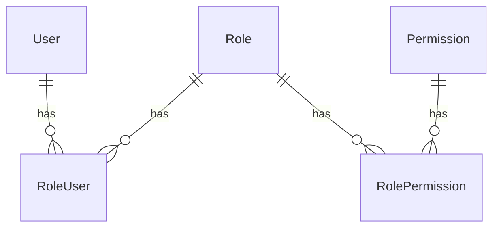

# RBAC

## Schema

Note Users are not part of the schema, instead the user_id must come from some other source, ideally the authorisation service you are using. 
Permissions must be seeded, the special Roles 'Super Admin' and 'Everyone' are seeded and protected.
Additional Roles are added through the API.
Permissions and Users can then be added to the Roles as RolePermissions and RoleUsers respectively using the API.
Role modifiers such as `write_access` or `locked_by_super_admin` are included in the RolePermission table.

